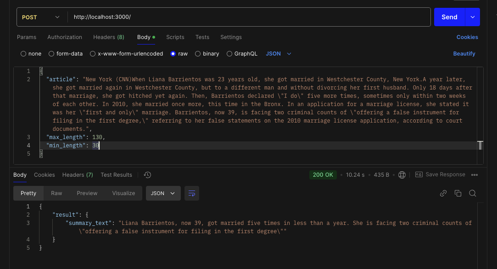

# Node.js and Python Integration POC

This project demonstrates a Proof of Concept (POC) for integrating a Python function (or machine learning model) directly into a Node.js/Express API. The Node.js server spawns a Python process to run a script and return the result, allowing for Python-based processing within a single API call. The Python script utilizes a pre-trained NLP model to perform summarization.

## Project Structure

- `server.js`: The main Express server file that defines an endpoint to interact with the Python script.
- `utils.js`: Utility file that provides a `runPythonScript` function to handle the Python script execution and error handling.
- `process_prompt.py`: Python script that executes models from the Hugging Face Transformers library.
- `model.py`: Custom function for executing the task.

## Requirements

- **Node.js** (version 14 or higher)
- **Python** (version 3.6 or higher)
- **Hugging Face Transformers** library for Python (for the NLP task).

### Node.js Dependencies

Install the Node.js dependencies by running:

```bash
npm install
```

### Python Dependencies

Install Python dependencies by running:

```bash
pip install transformers
```

## Setup

1. Clone the repository:
   ```bash
   git clone <repository-url>
   cd node-python-integration
   ```

2. Install dependencies as outlined above.

## Running the Project

1. Start the Node.js server:
   ```bash
   npm start
   ```
   The server will start at `http://localhost:3000`.



2. Test the endpoint with Postman or a similar API client:

   - URL: `http://localhost:3000/api/process`
   - Method: `POST`
   - Headers: `Content-Type: application/json`
   - Body (example):
     ```json
     {
         "article": "New York (CNN)When Liana Barrientos was 23 years old, she got married in Westchester County, New York.A year later, she got married again in Westchester County, but to a different man and without divorcing her first husband. Only 18 days after that marriage, she got hitched yet again. Then, Barrientos declared \"I do\" five more times, sometimes only within two weeks of each other. In 2010, she married once more, this time in the Bronx. In an application for a marriage license, she stated it was her \"first and only\" marriage. Barrientos, now 39, is facing two criminal counts of \"offering a false instrument for filing in the first degree,\" referring to her false statements on the 2010 marriage license application, according to court documents.",
         "max_length": 130,
         "min_length": 30
      }  
     ```

3. You should receive a JSON response with the summarized result.

## Project Usage

- **Integrate Machine Learning Models**: You can modify the Python script to use other models from the Hugging Face Transformers library or any custom Python function for specific NLP tasks.
- **API Endpoint**: This project can be extended to create a single, unified API endpoint where Python-based processing logic is required alongside Node.js logic.
